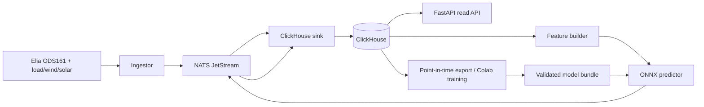

# Belgian real-time system-imbalance pipeline

Deze repository voorspelt de Belgische Elia system imbalance voor de volgende minuut, inclusief de kans dat de bevestigde toestand naar de andere kant van de hysteresisband flippt. Het is een operationele datapijplijn, geen trading- of dispatchadvies.



De onderdelen communiceren via versieerde JetStream-events. ClickHouse houdt de canonieke bron-, feature-, voorspelling- en outcome-records bij. Verwerking is at-least-once; stabiele event-IDs en ClickHouse `ReplacingMergeTree` maken herlevering logisch idempotent.

## Snel starten

Vereist: Docker Desktop met Compose v2. Kopieer desgewenst `.env.example` naar `.env` en wijzig wachtwoorden vóór een extern bereikbare deployment.

```bash
docker compose up --build --detach
curl --fail http://localhost:8000/health/ready
curl http://localhost:8000/v1/models/current
```

De standaardstack start NATS, ClickHouse, de migratiejob, Elia-ingestie, opslag, features, predictor, outcome-reconciliatie en API. De eerste minuten kunnen alleen gedegradeerde voorspellingen opleveren omdat er nog onvoldoende causale historie is. Dat is bewust gedrag: de fallback herhaalt uitsluitend de laatst waargenomen imbalance en markeert `prediction_quality="degraded"`.

Gebruik `make observability` voor Prometheus op `:9090` en Grafana op `:3000`. Gebruik `make down` voor een normale stop. `CONFIRM_CLEAN=1 make clean` verwijdert ook alle lokale NATS- en ClickHouse-data.

## Live dashboard

Open [http://localhost:8000/dashboard](http://localhost:8000/dashboard) om de actuele voorspelling naast de gerealiseerde netbalans te zien. Het dashboard gebruikt uitsluitend live records uit ClickHouse en ververst automatisch om de 15 seconden; er wordt geen test- of demodata toegevoegd. De grafiek toont de laatste zes uur, de voorspelling voor de volgende minuut en de p10-p90 onzekerheidsband. De historiektabel markeert elke flipvoorspelling als correct, fout of in afwachting.

Alle tijden worden in de interface als Belgische lokale tijd weergegeven. Het dashboard kan leeg zijn totdat de pipeline haar eerste voorspellingen en outcomes heeft opgeslagen. Bij een tijdelijke opslagfout blijft de laatst succesvol geladen inhoud zichtbaar.

## API

| Route | Doel |
| --- | --- |
| `GET /healthz` | Liveness zonder externe afhankelijkheid |
| `GET /health/ready` | ClickHouse plus gevalideerd model of toegestane fallback |
| `GET /v1/predictions/latest` | Nieuwste voorspelling |
| `GET /v1/predictions?start=…&end=…` | UTC-tijdsrange met keyset-paginatie |
| `GET /v1/models/current` | Actieve modelversie/schema, zonder filesystempad |
| `GET /metrics` | Prometheus-metrics |

Voorbeeld:

```bash
curl 'http://localhost:8000/v1/predictions?start=2026-07-13T10:00:00Z&end=2026-07-13T11:00:00Z&limit=100'
```

Een modelprediction bevat het puntvoorspelde MW-niveau, p10/p90, `flip_probability`, `will_flip`, de huidige en voorspelde bevestigde toestand, modelversie, feature-schemahash en kwaliteitsstatus.

## Historiek en Colab-training

Voor een gecontroleerde historische dag publiceert de ingestor de Elia-bronreeksen opnieuw in de normale stream:

```bash
make backfill START=2026-07-13T00:00:00Z END=2026-07-14T00:00:00Z
```

De historische backfill gebruikt expliciet Elia ODS133 (ODS161 blijft de live bron). De periode is bewust op maximaal één dag begrensd. Herhaal per dag of orkestreer dit extern; herlevering is veilig. Backfill bovendien minstens de volledige contextgeschiedenis vóór de eerste exportdag, anders kan de exporter de eerste voorbeelden niet causaal opbouwen. Exporteer daarna een point-in-time dataset en train met dezelfde packagecode:

```bash
make export-training START=2026-07-13T00:00:00Z END=2026-07-14T00:00:00Z OUTPUT=exports/imbalance-2026-07-13
make train DATASET=exports/imbalance-2026-07-13 OUTPUT=candidates/imbalance-2026-07-13
```

Valideer de kandidaat en promoot uitsluitend handmatig via `promote_bundle`; export en training wijzigen `models/production` nooit automatisch. Herstart na promotie de runtime:

```bash
docker compose restart predictor api
```

De notebook [notebooks/train_colab.ipynb](notebooks/train_colab.ipynb) vereist een GPU, gebruikt de drie vaste ensemble-seeds, stopt op een falende promotiegate en downloadt uitsluitend het checksummed bundle.

Plaats een goedgekeurd bundle onder `models/<version>/` en wijs `models/production` atomair naar die versie, of gebruik de bundle-promotiefunctie uit `imbalance_pipeline.model.bundle`. De predictor weigert schema- of checksumafwijkingen; met fallback aan blijft de service gedegradeerd beschikbaar.

## Model en labels

Het productiemodel is een compact driedelig probabilistisch TCN-Transformer-ensemble. Elke member verwerkt lokale minuutgeschiedenis, langzamer context en kalenderkenmerken; hij voorspelt een Gaussian-mixture verdeling voor t+1 en een fliplogit. De drie verdelingen worden gecombineerd, met isotonic-calibratie op een apart tijdssegment. De flip is alleen positief wanneer een eerder bevestigde positieve/negatieve staat één minuut later de andere bevestigde staat wordt; de configureerbare deadband voorkomt ruisflips.

Datasplits zijn strikt chronologisch met purge-gaps. De onberoerde testperiode wordt nooit gebruikt voor preprocessing, optimalisatie of calibratie. Zie [docs/model-card.md](docs/model-card.md) voor grenzen en evaluatiecriteria.

## Ontwikkelcommando's

```bash
make test                         # unit/contracttests, geen live calls
make up                           # standaardstack bouwen en starten
make observability                # stack + Prometheus/Grafana
make backfill START=… END=…       # één UTC-dag opnieuw ophalen
make train DATASET=… OUTPUT=…     # trainerprofiel in Docker
make smoke                        # opt-in live Elia smoke test
make down
```

`make smoke` voert een externe live call uit. De test is verder alleen actief met `IMBALANCE_RUN_LIVE_TESTS=1`.

## Data en licenties

Brondata komt van [Elia Open Data](https://opendata.elia.be/), met ODS161 voor de real-time imbalance en aanvullende load-, wind- en solarreeksen. Weerfeatures zijn optioneel. Respecteer de voorwaarden, beschikbaarheid en revisiegedrag van de bron: historische correcties blijven bronversies en worden niet stil overschreven.

Zie [docs/runbook.md](docs/runbook.md) voor operatorprocedures en [docs/verification-report.md](docs/verification-report.md) voor de reproduceerbare verificatiestatus.
