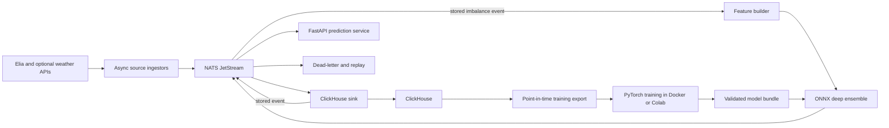

# Real-time system-imbalance forecasting pipeline

Date: 2026-07-13  
Status: approved design  
Primary target: Belgian system imbalance one minute ahead, in MW  
Secondary target: calibrated probability of a confirmed sign flip

## 1. Purpose and success criteria

The project delivers a reproducible end-to-end data and machine-learning pipeline that:

1. polls Elia's near-real-time open-data API and optional supporting sources;
2. publishes versioned events through NATS JetStream;
3. stores raw, normalized, feature, prediction, and outcome data in ClickHouse;
4. creates point-in-time-correct training and inference features;
5. trains a non-trivial probabilistic deep-learning ensemble locally or in Google Colab;
6. exports the ensemble to ONNX and serves it on CPU;
7. predicts system imbalance for the next minute and the probability of a robust sign flip;
8. remains replayable, observable, idempotent, and testable under Docker Compose.

The target operational behavior is:

- publish a prediction within ten seconds after receiving a new Elia minute record;
- retain all acknowledged events across container restarts;
- start the standard stack with `docker compose up --build`;
- expose a marked persistence fallback while a production model or sufficient history is unavailable;
- prove the full source-to-API path with a deterministic end-to-end fixture;
- promote a learned model only when it beats persistence and classical ML baselines on held-out walk-forward periods.

## 2. Scope

### Included

- Elia one-minute imbalance ingestion and historical backfill.
- Supporting Elia load, wind, photovoltaic, and relevant balancing features.
- Optional weather forecasts when point-in-time history is available and ablation proves incremental value.
- NATS JetStream transport, retry, replay, and dead-letter handling.
- ClickHouse storage and migrations.
- Feature engineering shared by training and online inference.
- PyTorch training, ONNX export, model validation, and CPU serving.
- A Google Colab notebook that imports the same project package rather than duplicating model logic.
- FastAPI prediction, model-status, health, readiness, and metrics endpoints.
- Unit, contract, integration, ML, failure-mode, and end-to-end tests.
- Docker Compose profiles for the standard stack, training, and optional observability.

### Excluded from the first release

- Automated electricity trading or dispatch decisions.
- Monetary profit optimization.
- Multi-region forecasting outside the Belgian Elia control area.
- Kubernetes or cloud-managed infrastructure.
- A public multi-tenant API, user accounts, or a browser dashboard.
- Automatic promotion of a model without quantitative validation.

## 3. Authoritative data sources

The implementation uses Elia Open Data Explore API 2.1. The main datasets are:

| Purpose | Historical | Near real-time | Native resolution |
|---|---|---|---|
| System imbalance, ACE, and price context after 2024-05-22 | ODS133 | ODS161 | 1 minute |
| Total load and forecasts | ODS001 | ODS002 | 15 minutes |
| Wind production and forecasts | ODS031 | ODS086 | 15 minutes |
| Photovoltaic production and forecasts | ODS032 | ODS087 | 15 minutes |

ODS161 is polled because Elia refreshes the dataset every minute; it is not a push stream. ODS133 is refreshed daily and is the primary post-MARI training source. Pre-MARI data may be retained for analysis but is not mixed into the initial production model because the market regime and schema differ.

Relevant official references:

- https://opendata.elia.be/explore/dataset/ods161/
- https://opendata.elia.be/explore/dataset/ods133/api/
- https://opendata.elia.be/explore/dataset/ods002/
- https://opendata.elia.be/explore/dataset/ods086/
- https://opendata.elia.be/explore/dataset/ods087/

External weather is an optional adapter. Training may use it only when the historical values reproduce forecasts that were available at prediction time. Reanalysis or final observations must not be presented as if they had been known in advance. Elia's own contemporaneous wind, photovoltaic, and load forecasts remain the default exogenous inputs.

## 4. System architecture



### Service boundaries

#### `ingestor`

- Owns source-specific HTTP clients and response normalization.
- Polls ODS161 frequently enough to detect each published minute without sending wasteful duplicate events.
- Polls slower 15-minute sources at a source-appropriate cadence.
- Supports bounded historical backfills with API pagination.
- Applies timeouts, exponential backoff with jitter, a retry budget, and rate-limit awareness.
- Publishes every source record with a deterministic event identifier.
- Does not write ClickHouse directly.

#### `clickhouse-sink`

- Uses durable JetStream pull consumers and explicit acknowledgements.
- Validates event envelopes and payload schemas.
- Inserts bounded batches into the appropriate ClickHouse table.
- Publishes a deterministic `stored` event after a successful insert.
- Acknowledges the source event only after both insert and stored-event publication succeed.
- Sends permanently invalid records to the corresponding dead-letter subject.

#### `feature-builder`

- Reacts only to `grid.stored.elia.imbalance.v1`, never directly to the raw source event.
- Queries only data available at or before the prediction cutoff.
- Builds the minute-resolution and context-resolution windows.
- Adds explicit missingness and staleness features for slower sources.
- Publishes one immutable feature snapshot for target minute `t+1`.
- Does not wait for a 15-minute source to refresh when the last known value is usable.

#### `predictor-api`

- Loads a validated model bundle and verifies its checksums, schema, and runtime compatibility.
- Consumes feature snapshots, runs the ONNX ensemble, and publishes prediction events.
- Persists the latest prediction view through the event sink.
- Exposes read-only REST, health, readiness, and Prometheus-compatible metrics endpoints.
- Falls back to a persistence forecast with `prediction_quality = "degraded"` when required.

#### `trainer`

- Reads an exported point-in-time dataset rather than reconstructing features independently.
- Trains baselines and the deep ensemble using walk-forward splits.
- Calibrates flip probabilities on a dedicated calibration period.
- Exports ONNX models and a versioned, checksummed manifest.
- Produces a machine-readable evaluation report used by the validator.

#### `model-validator`

- Verifies artifact structure and PyTorch-to-ONNX numerical parity.
- Rejects feature-schema mismatches, invalid checksums, leakage-test failures, or metric regressions.
- Promotes by atomically replacing a production model pointer; it never overwrites a functioning bundle in place.

## 5. Event design

JetStream contains one file-backed stream named `GRID_EVENTS`, covering `grid.>`. The local Docker deployment uses one replica and persistent storage. Production-like deployments can increase replica count without changing event contracts.

### Subjects

| Subject | Payload |
|---|---|
| `grid.raw.elia.imbalance.v1` | One normalized Elia minute record plus source metadata |
| `grid.raw.elia.load.v1` | One load observation or forecast record |
| `grid.raw.elia.wind.v1` | One wind observation or forecast record |
| `grid.raw.elia.solar.v1` | One photovoltaic observation or forecast record |
| `grid.raw.weather.forecast.v1` | Optional point-in-time weather forecast |
| `grid.stored.elia.imbalance.v1` | Idempotent trigger emitted after the imbalance row is queryable |
| `grid.features.imbalance.v1` | Immutable online feature snapshot |
| `grid.predictions.imbalance.v1` | Model or fallback forecast |
| `grid.outcomes.imbalance.v1` | Realized target joined to the original prediction |
| `grid.dlq.<source>.v1` | Rejected event plus failure classification |

### Common envelope

Every event contains:

- `event_id`: deterministic SHA-256 of source, dataset, natural key, and source version;
- `event_type` and `schema_version`;
- `source` and `dataset`;
- `event_time`: time represented by the payload;
- `observed_at`: source publication or observation time when available;
- `ingested_at`: local UTC receipt time;
- `correlation_id` and `causation_id`;
- `quality_status`;
- typed `payload`.

Consumers use explicit acknowledgement, bounded exponential redelivery, and a maximum delivery count. Invalid schemas and exhausted messages move to a dead-letter subject while retaining the original envelope and a safe error code. Operators can replay a bounded time range or selected event identifiers.

## 6. ClickHouse data model

All timestamps are stored as UTC `DateTime64(3, 'UTC')`. User-facing Brussels time is derived only at presentation boundaries.

The initial schema contains:

- `raw_events`: original event envelope and JSON payload, with a configurable retention period;
- `imbalance_observations`: system imbalance, ACE, price context, source quality, and ingestion metadata;
- `load_observations`;
- `wind_observations`;
- `solar_observations`;
- `weather_forecasts` when enabled;
- `feature_snapshots`: feature version, cutoff, target time, ordered `Array(Float32)` values, `Array(UInt8)` masks, feature-schema fingerprint, and diagnostic metadata;
- `predictions`: point estimate, distribution parameters or quantiles, flip probability, thresholded decision, quality, and model version;
- `prediction_outcomes`: immutable prediction-to-realization evaluation rows;
- `model_versions`: manifest metadata and validation metrics.

Time-series tables are partitioned by `toYYYYMM(event_time)` and ordered by their series key and event time. Deterministic identifiers plus `ReplacingMergeTree` version columns provide idempotence for at-least-once delivery. Queries that require an immediately canonical row use explicit latest-version aggregation rather than assuming background merges have completed.

Late corrections update the observation view but never mutate a historical prediction. The outcome process records which source version established the realization, preserving honest evaluation.

## 7. Feature and label definitions

### Prediction timing

Given the latest accepted imbalance minute `t`, the model predicts Elia `systemimbalance` for minute `t+1`. Every feature must have `available_at <= cutoff_t`. Source event time alone is insufficient when publication time is available.

### Hysteresis and flip

Let `s_t` be the confirmed state:

- `s_t = positive` when `y_t > +10 MW`;
- `s_t = negative` when `y_t < -10 MW`;
- when `-10 MW <= y_t <= +10 MW`, `s_t = s_(t-1)`;
- the first neutral observation has no confirmed state until a boundary is crossed.

The binary target is `flip_(t+1) = 1` exactly when both states are known and `s_(t+1) != s_t`. Samples without an established current state are excluded from the flip loss but remain usable for MW regression.

### Temporal inputs

The model receives:

- a 180-step, one-minute local window;
- a 24-hour context window resampled to 15-minute steps;
- known calendar and market-period context.

Minute features include system imbalance, ACE, relevant price fields, first and second differences, rolling means, exponentially weighted means, slopes, robust volatility, recent extrema, sign duration, distance to the hysteresis boundary, missingness, quality flags, and position within the settlement quarter-hour.

Exogenous features include actual load, load forecast and forecast error, wind and photovoltaic actuals and forecasts, forecast spreads, capacity or load factors when consistently available, and their staleness. All resampling is causal. Forward fills carry explicit age and missingness indicators and have bounded maximum ages.

Calendar features use cyclical encodings for minute, hour, weekday, day of year, quarter-hour position, daylight-saving transitions, and Belgian public holidays.

## 8. Model architecture

The production candidate is a deep ensemble of three independently seeded causal TCN-Transformer models.

### Encoder

- A residual dilated causal TCN captures local gradients, shocks, and short-range autoregression.
- A patch-based Transformer encoder captures longer interactions in the local and 24-hour context windows.
- A gated residual context encoder handles calendar and exogenous variables.
- Gated fusion combines branches while retaining masks and staleness information.

The network remains compact enough for three-model CPU inference inside the ten-second end-to-end budget. Training supports mixed precision and GPU acceleration in Colab.

### Heads and objectives

- A five-component Gaussian-mixture density head models the one-minute MW outcome. It outputs component weights, locations, and positive scales; its exact mixture CDF supplies the served median and uncertainty interval.
- A flip head outputs the probability of the hysteresis-defined state change.
- Auxiliary heads predict the one-minute delta and system imbalance at 2, 5, and 10 minutes.
- A consistency term penalizes disagreement between the flip head and the mixture probability beyond the opposite hysteresis boundary for the current confirmed state.
- The flip objective uses class-balanced focal loss to address rare events.

Task losses are normalized and weighted on validation data so that the auxiliary tasks cannot dominate the primary one-minute target. The ensemble averages the three mixture distributions and flip logits before calibration. P10, median, and P90 are obtained by deterministic bisection over the aggregated CDF, so ONNX and API output do not depend on random sampling.

### Served result

The public result includes:

```json
{
  "target_time": "2026-07-13T12:35:00Z",
  "generated_at": "2026-07-13T12:34:04Z",
  "system_imbalance_mw": -42.7,
  "p10_mw": -91.3,
  "p90_mw": 8.4,
  "flip_probability": 0.73,
  "will_flip": true,
  "current_confirmed_state": "positive",
  "predicted_state": "negative",
  "prediction_quality": "model",
  "model_version": "2026.07.1"
}
```

The `will_flip` threshold is selected on the calibration set according to balanced precision and recall unless a later business cost function is supplied. The numeric probability remains available so clients are not forced to use the default threshold.

## 9. Training and evaluation

The dataset is split chronologically. Random train/test splitting is prohibited.

The evaluator uses expanding or rolling walk-forward folds with a gap at least as long as the largest feature window. The final test period is untouched by architecture selection, task weighting, threshold selection, and probability calibration.

Baselines include:

- persistence: `y_hat_(t+1) = y_t`;
- recent linear drift and robust rolling estimators;
- a classical tree-based baseline trained on the same point-in-time features.

Regression metrics include MAE, RMSE, pinball or distributional loss, interval coverage, interval width, directional accuracy, and performance by volatility, quarter-hour position, and source-quality cohort. Flip metrics include PR-AUC, ROC-AUC for reference, Brier score, log loss, calibration error, precision, recall, F1, and confusion matrices at the promoted threshold.

A candidate is promotable only when:

1. its aggregate MAE is at least 2% lower than persistence on the held-out walk-forward evaluation;
2. no critical cohort has MAE more than 5% worse than persistence;
3. its flip PR-AUC is higher and its Brier score at least 1% lower than the classical baseline without violating the MW criteria;
4. empirical P10-P90 coverage lies between 75% and 85% on the final test period;
5. PyTorch and ONNX predictions agree with maximum absolute error below `1e-4` for raw model outputs;
6. leakage, schema, and reproducibility checks pass.

The first full production threshold is determined from the actual backtest report rather than hard-coded before data is inspected.

## 10. API contract

FastAPI exposes:

- `GET /v1/predictions/latest`;
- `GET /v1/predictions?from=<UTC>&to=<UTC>&limit=<n>`;
- `GET /v1/models/current`;
- `GET /health/live`;
- `GET /health/ready`;
- `GET /metrics`.

The prediction endpoints are read-only. Invalid ranges return structured `4xx` responses. Dependency failure returns `503` only when no real or degraded prediction can be served. Readiness requires NATS and ClickHouse connectivity plus either a valid model or an explicitly enabled fallback.

Authentication is not included for the local Compose deployment. A public deployment must place the service behind TLS, authentication, rate limiting, and an allowlisted network boundary.

## 11. Resilience and observability

The system uses structured JSON logs with service, event, correlation, model, and trace identifiers. Secrets and full unexpected source payloads are not logged.

Prometheus metrics cover:

- source request rate, status, latency, retries, and newest-record age;
- JetStream publish, delivery, redelivery, pending, and dead-letter counts;
- ClickHouse insert size, latency, and errors;
- feature freshness, missingness, staleness, and rejected snapshots;
- inference latency, fallback rate, model version, and prediction distributions;
- delayed outcome joins, rolling MAE, flip Brier score, and drift indicators.

The optional observability Compose profile provides Prometheus and Grafana dashboards. Health checks distinguish liveness from readiness. Docker services restart safely because state resides in persistent JetStream and ClickHouse volumes and consumers are durable.

If external exogenous data is stale, the model uses its masks and age features. If the core imbalance source is stale, the service does not fabricate a new model timestamp; it serves the last result with explicit staleness metadata until a new source minute appears.

## 12. Docker and developer workflow

The standard Compose profile contains NATS, ClickHouse, schema initialization, ingestor, sink, feature builder, and predictor API. The `training` profile adds export and trainer commands. The `observability` profile adds Prometheus and Grafana.

Images use multi-stage builds, pinned dependency ranges, non-root application users, health checks, read-only application filesystems where practical, and named volumes for state. Configuration is supplied through environment variables documented in `.env.example`; source code contains no secrets.

Expected commands are:

```bash
make up
make backfill
make test
make train
make smoke
```

The Colab notebook installs the project package, obtains an exported dataset, trains the same ensemble implementation, writes the validation report, and downloads a model bundle. The bundle contains ONNX members, preprocessing metadata, calibration parameters, a feature-schema fingerprint, training provenance, metrics, and SHA-256 checksums.

## 13. Testing strategy

### Unit tests

- event envelope and payload validation;
- deterministic identifiers;
- hysteresis and flip labels, including neutral-band edge cases;
- causal rolling and resampling features;
- missingness and staleness rules;
- model tensor shapes, masks, losses, and ensemble aggregation;
- model manifest and checksum validation.

### Contract tests

- recorded Elia API responses and pagination;
- stable source-to-domain mappings;
- backward-compatible event schemas;
- FastAPI request and response schemas.

### Integration tests

- JetStream durable consumption, retry, redelivery, and dead-letter behavior;
- ClickHouse insert and latest-version idempotence;
- feature generation from stored history;
- prediction publication and read API behavior;
- restart recovery with persistent volumes.

### ML tests

- no feature has an availability time after the cutoff;
- chronological folds and purge gaps are enforced;
- PyTorch and ONNX parity;
- probability calibration is fit only on the calibration period;
- the promotion report contains every required metric and cohort.

### End-to-end and failure tests

A deterministic fixture source sends a known sequence through ingestion, JetStream, ClickHouse, feature construction, ONNX inference, prediction persistence, and REST retrieval. Additional tests cover duplicate events, a missing minute, malformed source fields, slow or unavailable APIs, stale exogenous sources, service interruption after insert but before acknowledgement, and an invalid model bundle.

## 14. Delivery and rollout

The repository will contain application packages, schemas, migrations, tests, Docker definitions, Compose profiles, a Makefile, model configuration, a small deterministic test artifact, a Colab notebook, architecture documentation, operational instructions, and `.env.example`.

Rollout proceeds in four explicit stages:

1. run deterministic and recorded-response tests;
2. run live ingestion in shadow mode and validate freshness and schema behavior;
3. backfill training data, train in Colab, and produce a walk-forward report;
4. promote the validated bundle and monitor predictions against realized outcomes.

The service never places trades or controls grid assets. Its output is an informational forecast whose reliability is reported through uncertainty, probability calibration, data freshness, and model version metadata.
